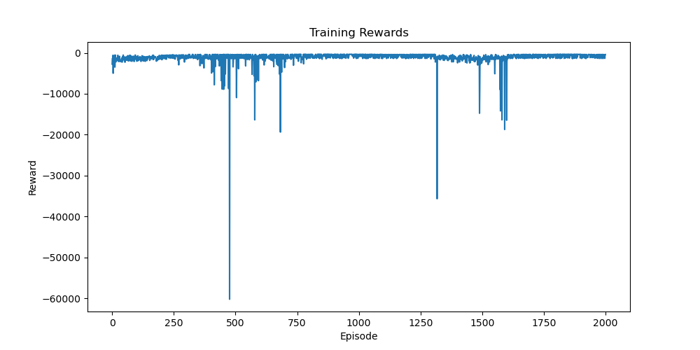
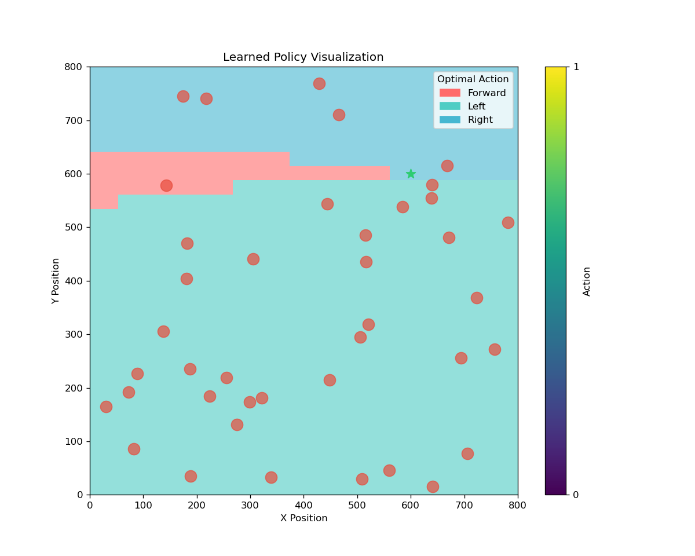
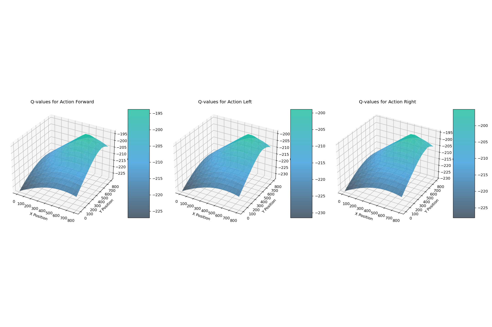
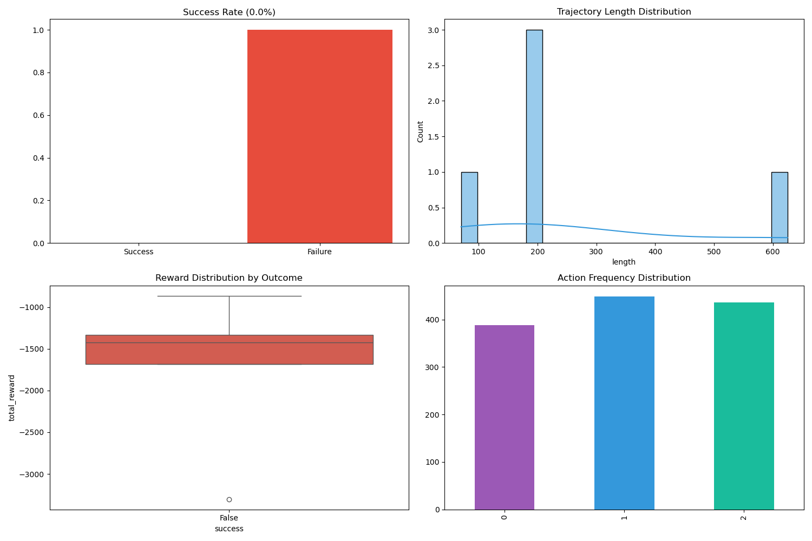

# 第一阶段：简单场景下智能体的诞生

## 项目概述

这是 RLDriverX 项目的第一阶段，实现了一个基础的强化学习框架，用于训练智能体在二维环境中进行导航。该阶段主要关注基础的避障和导航能力。

## 环境设计

- **环境尺寸**：800×800 像素的二维网格世界
- **目标点**：固定位置（环境右上角区域）
- **障碍物**：随机分布的静态障碍物（40个，半径12像素）
- **传感器**：8个方向的距离传感器，范围25单位
- **车辆尺寸**：长4单位，宽2单位

## 智能体设计

### 状态空间
- 8个传感器的归一化距离读数（范围[0,1]）
- 车辆与目标间的相对距离和角度信息

### 动作空间
- 前进（速度2单位/步）
- 左转（π/10弧度）
- 右转（π/10弧度）

### 奖励设计
- 成功到达目标：+500
- 与障碍物或边界碰撞：-100
- 每步小惩罚：-0.1
- 接近目标的奖励：基于距离变化的正向激励

## 技术实现

### 核心算法
- DQN（Deep Q-Network）实现
- 经验回放机制（缓冲区大小10000）
- ε-贪婪探索策略（从1.0衰减到0.01）

### 网络结构
- 输入层：10个神经元
- 隐藏层：64个神经元
- 输出层：3个神经元

### 训练参数
- 学习率：0.001
- 折扣因子：0.99
- 批次大小：64
- 目标网络更新频率：100步
- 训练回合数：2000

## 实验结果

### 训练效果
- 经过2000个训练回合后，智能体能够完成基本的导航任务
- 智能体学会了基本的避障和路径规划能力
- 在简单场景下能够稳定到达目标

### 可视化结果

#### 训练过程分析

*图1：训练过程中的奖励变化曲线*

#### 策略分析

*图2：智能体在不同状态下的策略分布*


*图3：Q值的三维分布图*

#### 训练统计

*图4：训练过程中的各项统计指标*

#### 演示视频
项目包含以下演示视频：
- [基础评估演示](videos/evaluation.mp4)：展示智能体在基础场景中的表现
- [增强评估演示](videos/evaluation_enhanced.mp4)：展示智能体在增强场景中的表现
- [复杂场景演示](videos/evaluation_complex.mp4)：展示智能体在复杂场景中的表现
- [样本回合演示](videos/sample_episode.mp4)：展示单个训练回合的完整过程

## 运行说明

### 环境要求
- Python 3.7+
- PyTorch
- NumPy
- Matplotlib
- tqdm

### 运行方法
```bash
python main.py
```

## 项目结构
```
First Try-简单场景下智能体的诞生/
├── main.py              # 主程序入口
├── 可视化增强.py        # 可视化工具
├── 高级可视化扩展.py    # 高级可视化功能
├── models/             # 模型保存目录
├── videos/            # 训练过程视频保存目录
└── visualizations/    # 可视化结果目录
```

## 后续改进方向
1. 优化传感器配置和范围
2. 改进网络结构和训练参数
3. 增加动态障碍物
4. 实现更复杂的场景
5. 优化奖励机制 