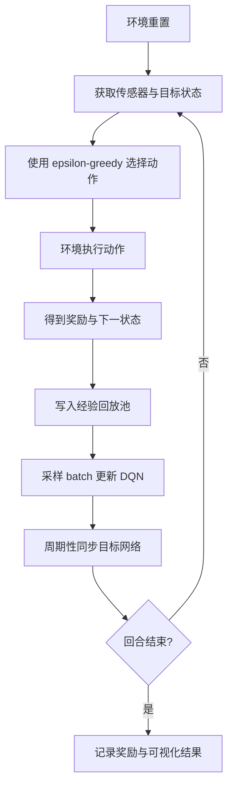

# 第一阶段：简单场景下智能体的诞生

第一阶段是 RLDriverX 的起点。它并不追求复杂环境或最优性能，而是解决一个更基础也更关键的问题：在一个可控、可解释的二维世界中，强化学习智能体能否从零开始学会避障并逼近目标。

## 目录

- [阶段目标](#阶段目标)
- [任务建模](#任务建模)
- [状态、动作与奖励](#状态动作与奖励)
- [DQN 方法](#dqn-方法)
- [训练流程](#训练流程)
- [环境与实现要点](#环境与实现要点)
- [运行方式](#运行方式)
- [已有产物](#已有产物)
- [阶段意义与局限](#阶段意义与局限)

## 阶段目标

第一阶段的核心目标可以概括为三点：

1. 建立一个最小但完整的强化学习实验闭环。
2. 让智能体能够利用局部距离感知完成避障。
3. 用最基础的 DQN 证明该任务具备可学习性。

如果把整个项目看作一条技术路线，这一阶段相当于“证明问题可做”。

## 任务建模

这一阶段可以被抽象为一个有限动作空间下的 Markov Decision Process:

$$
\mathcal{M}=(\mathcal{S}, \mathcal{A}, \mathcal{P}, \mathcal{R}, \gamma)
$$

其中：

- $\mathcal{S}$ 表示由传感器读数和目标相对位置共同构成的状态空间。
- $\mathcal{A}=\{\text{forward},\text{left},\text{right}\}$。
- $\mathcal{R}$ 由到达目标奖励、碰撞惩罚、步长惩罚和距离改变量组成。
- $\gamma=0.99$。

## 状态、动作与奖励

### 状态

状态由以下两部分组成：

- 8 个方向距离传感器的归一化读数。
- 小车相对于目标的距离与角度信息。

从代码实现看，第一阶段使用的是典型的“局部感知 + 目标方向”建模方式，这种设计非常适合用来验证 DQN 能否学到基本导航策略。

### 动作

动作空间是离散的三元集合：

$$
a \in \{0,1,2\}
$$

分别表示：

- `0`：前进
- `1`：左转并前进
- `2`：右转并前进

### 奖励

奖励大致由四部分构成：

$$
r_t = r_{\text{goal}} + r_{\text{collision}} + r_{\text{step}} + r_{\text{progress}}
$$

其中：

- 到达目标：强正奖励
- 碰撞边界或障碍：强负奖励
- 每一步：小负奖励
- 朝目标距离缩短：正向 shaping

这种奖励设计的核心思想不是一次性把“最优驾驶”编码进去，而是先把“少撞、多接近目标”这个信号设计清楚。

## DQN 方法

这一阶段采用 DQN 进行值函数学习。目标网络与经验回放的引入，使训练不至于完全被在线采样噪声破坏。

损失函数写作：

$$
L(\theta)=\mathbb{E}_{(s,a,r,s')\sim \mathcal{D}}
\left[
\left(
r+\gamma \max_{a'}Q_{\theta^-}(s',a')-Q_{\theta}(s,a)
\right)^2
\right]
$$

网络本质上学习的是状态到动作价值的映射：

$$
Q_\theta(s,a)
$$

然后通过

$$
a^\* = \arg\max_a Q_\theta(s,a)
$$

选择动作。

## 训练流程


```mermaid
flowchart TD
    A[环境重置] --> B[获取传感器与目标状态]
    B --> C[使用 epsilon-greedy 选择动作]
    C --> D[环境执行动作]
    D --> E[得到奖励与下一状态]
    E --> F[写入经验回放池]
    F --> G[采样 batch 更新 DQN]
    G --> H[周期性同步目标网络]
    H --> I{回合结束?}
    I -- 否 --> B
    I -- 是 --> J[记录奖励与可视化结果]
```

## 环境与实现要点

根据 [main.py](main.py) 中的实现，第一阶段的关键设定包括：

- 地图大小：`800 x 800`
- 传感器数量：`8`
- 传感器范围：`25`
- 障碍物数量：`40`
- 障碍物半径：`12`
- 小车长度 / 宽度：`4 / 2`
- 批大小：`64`
- 折扣因子：`0.99`
- 经验回放池：`10000`
- 学习率：`0.001`
- 总训练轮数：`2000`

这些参数说明第一阶段的重心是“先稳定训练起来”，而不是“在复杂设定里追求高上限”。

## 运行方式

```bash
python main.py
```

## 已有产物

仓库中保留了这一阶段的完整展示材料：

- 模型：`models/best_model.pth`
- 奖励曲线：`training_rewards.png`
- 策略图：`visualizations/policy_map.png`
- Q 值三维可视化：`visualizations/q_values_3d.png`
- 回合统计图：`visualizations/episode_stats.png`
- 视频：
  - `videos/evaluation.mp4`
  - `videos/evaluation_enhanced.mp4`
  - `videos/evaluation_complex.mp4`
  - `videos/sample_episode.mp4`

## 阶段意义与局限

### 这一阶段为什么重要

- 它给项目提供了第一条完整可运行的实验链路。
- 它证明“基于局部距离传感器的导航问题”在这个环境里是可学习的。
- 它为第二阶段的算法增强和第三阶段的系统重构提供了对照基线。

### 局限

- 目标位置固定，泛化性有限。
- 动作是离散的，控制不够平滑。
- 感知仍然偏局部，缺乏更丰富的环境表达。
- 场景复杂度不高，更多是原型验证而不是复杂驾驶任务。

从研究与工程的角度看，第一阶段最重要的价值不是效果“有多强”，而是它把问题简化到了足以被理解、被调试、被复现的程度。
