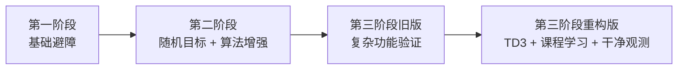

# RLDriverX: 强化学习驱动的渐进式二维自动驾驶项目

RLDriverX 是一个围绕“自动驾驶智能体如何从能动起来，到能稳定导航，再到能面对复杂动态场景”这一问题展开的阶段式强化学习项目。仓库按照三个阶段组织，分别对应基础 DQN、优化后的 Double DQN，以及已经完成重构的 TD3 多模态连续控制系统。

从工程视角看，这个仓库不是单一模型的最终版，而是一条完整的技术演化路径。它既保留了早期原型的教学价值，也包含了后期系统重构后的方法论价值。

## 目录

- [项目定位](#项目定位)
- [阶段演化总览](#阶段演化总览)
- [方法路线](#方法路线)
- [项目结构](#项目结构)
- [三个阶段分别解决什么问题](#三个阶段分别解决什么问题)
- [快速开始](#快速开始)
- [结果与产物说明](#结果与产物说明)
- [第三阶段重构摘要](#第三阶段重构摘要)
- [推荐阅读顺序](#推荐阅读顺序)

## 项目定位

这个项目的核心不是单纯“训练一个车”，而是围绕以下三个问题逐步展开：

1. 在简单二维环境中，智能体能否通过强化学习学会基本避障和接近目标。
2. 当目标随机化、障碍更密集、算法更复杂时，系统能否保持稳定学习。
3. 当任务切换到连续控制、多模态输入和动态环境后，如何重新设计观测、奖励、训练流程与算法，使系统仍然可训练、可解释、可扩展。

## 阶段演化总览

| 阶段 | 任务特征 | 状态/观测 | 动作空间 | 核心算法 | 当前定位 |
| --- | --- | --- | --- | --- | --- |
| 第一阶段 | 固定目标、静态障碍 | 8 路传感器 + 相对目标信息 | 离散 | DQN | 基础原型 |
| 第二阶段 | 随机目标、障碍增多、控制更平滑 | 16 路传感器 + 相对目标信息 | 离散 | Double DQN + PER | 表现最佳 |
| 第三阶段 | 连续控制、动态障碍、移动目标、多模态输入 | `radar + vector + visual` | 连续 | TD3 + Curriculum Learning | 已重构、待正式长训 |



## 方法路线

从强化学习方法论上，这个项目经历了从离散值函数方法到连续控制 Actor-Critic 方法的转变。

### 第一阶段：DQN

第一阶段采用经典 DQN，优化目标可以写成：

$$
L(\theta)=\mathbb{E}_{(s,a,r,s')\sim \mathcal{D}}
\left[
\left(
r+\gamma \max_{a'}Q_{\theta^-}(s',a')-Q_{\theta}(s,a)
\right)^2
\right]
$$

### 第二阶段：Double DQN + Prioritized Experience Replay

第二阶段用 Double DQN 缓解过估计问题：

$$
y=r+\gamma Q_{\theta^-}\left(s',\arg\max_{a'}Q_{\theta}(s',a')\right)
$$

同时使用优先经验回放，根据 TD 误差分配采样概率：

$$
P(i)=\frac{p_i^\alpha}{\sum_k p_k^\alpha},
\qquad
w_i=\left(\frac{1}{N\cdot P(i)}\right)^\beta
$$

### 第三阶段：TD3

第三阶段改为连续控制，采用 TD3 训练 Actor 与 Twin Critic：

$$
y=r+\gamma (1-d)\min_{j=1,2}Q_{\phi_j^-}(s', \pi_{\theta^-}(s')+\epsilon)
$$

其中

$$
\epsilon \sim \text{clip}(\mathcal{N}(0,\sigma),-c,c)
$$

策略通过延迟更新降低价值估计偏差：

$$
\nabla_\theta J(\theta)
=
\mathbb{E}_s\left[
\nabla_a Q_{\phi_1}(s,a)\vert_{a=\pi_\theta(s)}
\nabla_\theta \pi_\theta(s)
\right]
$$

## 项目结构

```text
RLDriverX/
├── First Try-简单场景下智能体的诞生/
├── Second Try-随机目标且优化算法的智能体/
├── Third Try-复杂场景实现与多模态集成/
├── docs/
│   └── 技术路线与方法论.md
├── LICENSE
└── README.md
```

## 三个阶段分别解决什么问题

### 第一阶段

第一阶段的目标是搭通最小强化学习闭环：

- 构建一个简洁、可视化、可训练的二维导航环境。
- 证明智能体可以通过距离传感器完成基础避障。
- 验证奖励设计、经验回放、目标网络更新这些基本组件是有效的。

详细文档见：[第一阶段 README](First%20Try-%E7%AE%80%E5%8D%95%E5%9C%BA%E6%99%AF%E4%B8%8B%E6%99%BA%E8%83%BD%E4%BD%93%E7%9A%84%E8%AF%9E%E7%94%9F/README.md)

### 第二阶段

第二阶段的目标是把“能学”推进到“学得更稳、更强、更泛化”：

- 目标从固定位置改成随机位置。
- 传感器更密、环境更复杂。
- 算法从普通 DQN 升级到 Double DQN + 优先经验回放。
- 训练稳定性和效果达到整个仓库当前最成熟的水平。

详细文档见：[第二阶段 README](Second%20Try-%E9%9A%8F%E6%9C%BA%E7%9B%AE%E6%A0%87%E4%B8%94%E4%BC%98%E5%8C%96%E7%AE%97%E6%B3%95%E7%9A%84%E6%99%BA%E8%83%BD%E4%BD%93/README.md)

### 第三阶段

第三阶段把问题升级成一个更接近“自动驾驶原型系统”的任务：

- 动作从离散切到连续。
- 观测从单一传感器扩展为多模态。
- 环境中加入动态障碍物和移动目标。
- 训练流程引入课程学习。
- 算法改为 TD3，修复旧版实现中的关键理论与工程问题。

详细文档见：[第三阶段 README](Third%20Try-%E5%A4%8D%E6%9D%82%E5%9C%BA%E6%99%AF%E5%AE%9E%E7%8E%B0%E4%B8%8E%E5%A4%9A%E6%A8%A1%E6%80%81%E9%9B%86%E6%88%90/README.md)

## 快速开始

### 第一阶段

```bash
cd "First Try-简单场景下智能体的诞生"
python main.py
```

### 第二阶段

```bash
cd "Second Try-随机目标且优化算法的智能体"
python main.py
```

### 第三阶段

建议在独立环境中运行，例如 `pytorch_env`：

```bash
cd "Third Try-复杂场景实现与多模态集成"
pip install -r requirements.txt
python src/train.py
```

测试模型：

```bash
python src/test.py --model_path logs/<run_name>/best_model.pt
```

如果想先训练一个更稳定、更轻量的基线：

```bash
python src/train.py --disable_visual
```

## 结果与产物说明

### 第一阶段

- 保留了模型、奖励曲线、策略图、Q 值可视化和演示视频。
- 适合作为基础原理展示和项目起点说明。

### 第二阶段

- 保留了训练指标图和评估视频。
- 从仓库当前结果看，它是最适合直接展示效果的一版。

### 第三阶段

- `logs/20250519_*` 是旧版第三阶段留下的历史实验记录。
- 这些日志可以作为“旧方案为什么不够理想”的对照材料。
- 第三阶段代码已经重构完成，但新的正式性能仍需要长时间训练重新生成。

## 第三阶段重构摘要

第三阶段这次不是“调参”，而是一次结构性修复：

- 把错误的连续控制更新逻辑替换成真正的 TD3。
- 把 critic 改成正确的 $Q(s,a)$ 结构。
- 把给模型看的视觉输入和给人看的演示渲染彻底分开。
- 重新设计奖励，使“朝目标推进”成为主信号。
- 引入课程学习，避免训练一开始就面对全复杂场景。
- 统一 checkpoint、评估、指标统计与输出格式。

更详细的技术说明见：[技术路线与方法论](docs/%E6%8A%80%E6%9C%AF%E8%B7%AF%E7%BA%BF%E4%B8%8E%E6%96%B9%E6%B3%95%E8%AE%BA.md)

## 推荐阅读顺序

如果你是第一次接触这个仓库，建议按下面顺序阅读：

1. 根 README：理解整体目标和三阶段关系。
2. 第一阶段 README：理解最小闭环是如何搭起来的。
3. 第二阶段 README：理解性能为什么显著提升。
4. 第三阶段 README：理解复杂环境和连续控制系统如何重构。
5. `docs/技术路线与方法论.md`：从更系统的角度看方法、公式与架构设计。

## 许可证

本项目采用 MIT License，见 [LICENSE](LICENSE)。
