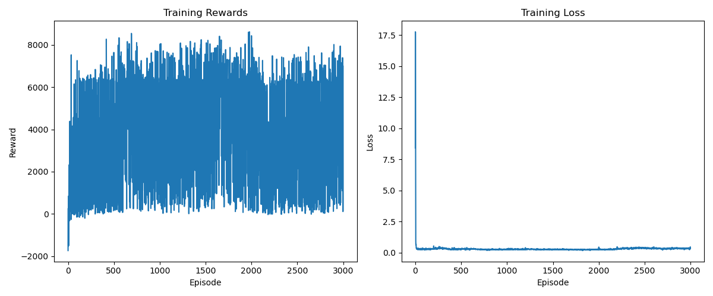

# 第二阶段：随机目标且优化算法的智能体

## 项目概述

这是 RLDriverX 项目的第二阶段，在第一阶段的基础上进行了优化和扩展。本阶段引入了随机目标位置，并实现了更先进的强化学习算法，提升了系统的性能和适应性。项目实现了一个基于深度强化学习的自动驾驶智能体，能够在包含随机障碍物的环境中导航到随机目标位置。

## 环境增强

### 基础环境改进
- **环境尺寸**：800×800 像素的连续空间
- **目标点**：随机位置生成，部分概率在对角线另一侧
- **障碍物**：多个静态障碍物，采用改进的生成算法确保合理分布
- **传感器**：多方向传感器，提供更全面的环境感知

### 车辆模型优化
- 平滑的转向控制
- 改进的速度控制
- 转向时自动减速
- 更真实的物理仿真（考虑车辆尺寸和碰撞检测）

## 算法升级

### 双重 DQN（Double DQN）
- 分离动作选择和评估网络
- 采用软更新目标网络策略
- 减少Q值过估计问题
- 使用梯度裁剪提高训练稳定性

### 优先经验回放（Prioritized Experience Replay）
- 基于TD-误差的优先级排序
- 使用SumTree数据结构实现高效采样
- 重要性采样权重校正
- 较大的经验回放池

### 网络结构优化
- 扩大网络容量
- 添加Dropout防止过拟合
- 改进的参数初始化策略
- 使用Adam优化器

## 训练过程

### 训练参数
- 较长的训练轮数
- 探索策略：ε-贪婪（从高到低逐步衰减）
- 适当的折扣因子
- 合理的批处理大小

### 训练效果


训练过程展示了以下特点：
- 奖励值逐步提升
- 探索率合理衰减
- 损失函数收敛
- 成功率逐步提高

## 评估结果

### 性能指标
- 成功率显著提升
- 平均步数减少
- 泛化能力提升
- 训练稳定性提高

### 演示视频
[点击查看评估演示视频](videos/evaluation.mp4)

视频展示了智能体在以下场景中的表现：
- 随机目标位置导航
- 复杂障碍物环境中的避障
- 平滑的转向和速度控制
- 稳定的路径规划

## 运行说明

### 环境要求
- Python 3.7+
- PyTorch 1.7.0+
- NumPy 1.19.2+
- Matplotlib 3.3.2+
- Pygame 2.0.0+

### 运行方法
```bash
python main.py
```

### 主要功能
- 训练模式：完整训练过程
- 评估模式：展示训练好的模型
- 可视化：实时显示训练过程
- 视频保存：记录评估过程

## 项目结构
```
Second Try-随机目标且优化算法的智能体/
├── main.py              # 主程序入口
├── models/             # 保存训练模型
├── videos/             # 评估视频
└── training_metrics.png # 训练指标可视化
```

## 技术亮点

1. **算法创新**
   - 双重DQN减少过估计
   - 优先经验回放提高学习效率
   - 改进的探索策略
   - 智能的障碍物生成算法

2. **性能优化**
   - 更稳定的训练过程
   - 更好的泛化能力
   - 更快的收敛速度
   - 平滑的动作控制

3. **代码质量**
   - 模块化设计
   - 完善的注释
   - 清晰的接口
   - 可复现的结果

## 后续改进方向
1. 引入多模态感知
2. 实现课程学习
3. 增加动态障碍物
4. 优化计算效率
5. 增强可视化功能
6. 添加多智能体协作
7. 实现更复杂的任务场景 