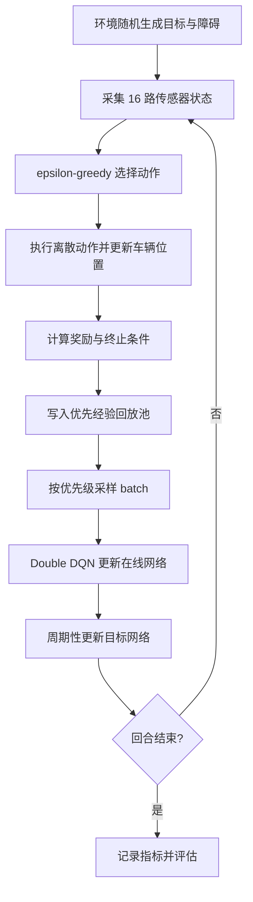

# 第二阶段：随机目标且优化算法的智能体

第二阶段是 RLDriverX 从“能学会”走向“学得更稳、更强、更泛化”的关键一步。它在第一阶段的基础上同时提升了任务难度和算法能力，因此是当前仓库中训练效果最成熟、最适合对外展示的一版。

## 目录

- [阶段目标](#阶段目标)
- [相较第一阶段的升级](#相较第一阶段的升级)
- [问题建模](#问题建模)
- [核心算法：Double DQN 与 PER](#核心算法double-dqn-与-per)
- [训练流程](#训练流程)
- [为什么这一阶段表现最好](#为什么这一阶段表现最好)
- [运行方式](#运行方式)
- [已有产物](#已有产物)
- [阶段意义与局限](#阶段意义与局限)

## 阶段目标

第二阶段试图解决两个第一阶段还没有真正解决的问题：

1. 当目标位置变成随机时，策略是否仍然能够泛化。
2. 当环境更复杂、训练更长时，如何减少 DQN 的估计偏差并提升采样效率。

换句话说，这一阶段不再只是“验证 DQN 能用”，而是开始进入“如何让策略更可靠地学出来”。

## 相较第一阶段的升级

| 维度 | 第一阶段 | 第二阶段 |
| --- | --- | --- |
| 目标位置 | 固定 | 随机 |
| 传感器数量 | 8 | 16 |
| 传感器范围 | 25 | 50 |
| 障碍物数量 | 40 | 60 |
| 控制风格 | 基础离散控制 | 更平滑的离散控制 |
| 算法 | DQN | Double DQN + Prioritized Replay |

这些修改同时提升了环境难度与算法能力，使第二阶段成为一个更接近“稳定导航器”的系统。

## 问题建模

第二阶段依旧是离散动作强化学习问题，但它更强调在随机目标场景下的泛化。

状态依然可以写作：

$$
s_t=[z_t, g_t]
$$

其中：

- $z_t$ 表示多路传感器读数；
- $g_t$ 表示相对目标距离与方向信息。

动作仍为离散三元集合，但控制策略更平滑，尤其是在转向时引入了减速逻辑，使轨迹更自然。

## 核心算法：Double DQN 与 PER

### Double DQN

普通 DQN 容易出现 Q 值过估计，第二阶段通过 Double DQN 将动作选择和动作评估解耦：

$$
y=r+\gamma Q_{\theta^-}\left(s',\arg\max_{a'}Q_\theta(s',a')\right)
$$

这里：

- 在线网络 $Q_\theta$ 负责选动作；
- 目标网络 $Q_{\theta^-}$ 负责评估动作。

这样可以在保持 DQN 框架简洁性的同时，显著缓解过估计问题。

### Prioritized Experience Replay

第二阶段还引入了优先经验回放，使学习更关注“更有信息量”的样本。采样概率通常写成：

$$
P(i)=\frac{p_i^\alpha}{\sum_k p_k^\alpha}
$$

对应的重要性采样权重为：

$$
w_i=\left(\frac{1}{N\cdot P(i)}\right)^\beta
$$

其中：

- $p_i$ 与样本 TD 误差有关；
- $\alpha$ 控制优先级强度；
- $\beta$ 控制重要性采样校正力度。

这意味着第二阶段不仅学得更稳，也学得更“有效率”。

## 训练流程


```mermaid
flowchart TD
    A[环境随机生成目标与障碍] --> B[采集 16 路传感器状态]
    B --> C[epsilon-greedy 选择动作]
    C --> D[执行离散动作并更新车辆位置]
    D --> E[计算奖励与终止条件]
    E --> F[写入优先经验回放池]
    F --> G[按优先级采样 batch]
    G --> H[Double DQN 更新在线网络]
    H --> I[周期性更新目标网络]
    I --> J{回合结束?}
    J -- 否 --> B
    J -- 是 --> K[记录指标并评估]
```

## 为什么这一阶段表现最好

从当前仓库保留下来的结果看，第二阶段是三者中最平衡的一版。原因不是单一因素，而是多个条件共同成立：

- 任务已经具备足够随机性，策略必须真正学会导航。
- 动作仍然是离散的，训练难度可控。
- Double DQN 改善了 Q 值偏差问题。
- 优先经验回放提升了样本利用效率。
- 场景复杂度上升，但还没有高到压垮训练目标。

这也是为什么第二阶段常常会成为整个项目中“效果最好”的版本。

## 运行方式

```bash
python main.py
```

主实现文件见：[main.py](main.py)

## 已有产物

当前仓库中保留了这一阶段最主要的展示结果：

- 模型：`models/best_model.pth`
- 训练指标图：`training_metrics.png`
- 评估视频：`videos/evaluation.mp4`

这些产物足以支撑对第二阶段性能的展示与说明。

## 阶段意义与局限

### 这一阶段的意义

- 它证明第一阶段的原型并非偶然有效，而是可以扩展的。
- 它让项目第一次具备了比较明显的“泛化能力”。
- 它为第三阶段的升级提供了最有价值的性能参照。

### 局限

- 动作仍然是离散的，不是真正的连续驾驶控制。
- 主要依赖传感器和向量状态，没有真正进入多模态感知。
- 没有动态障碍物，也没有移动目标。
- 更像“高级导航器”，还不像“复杂场景下的驾驶系统”。

因此，第二阶段的意义在于：它不是终点，但它是整个项目当前最强、最稳、最具有展示价值的中期版本。
