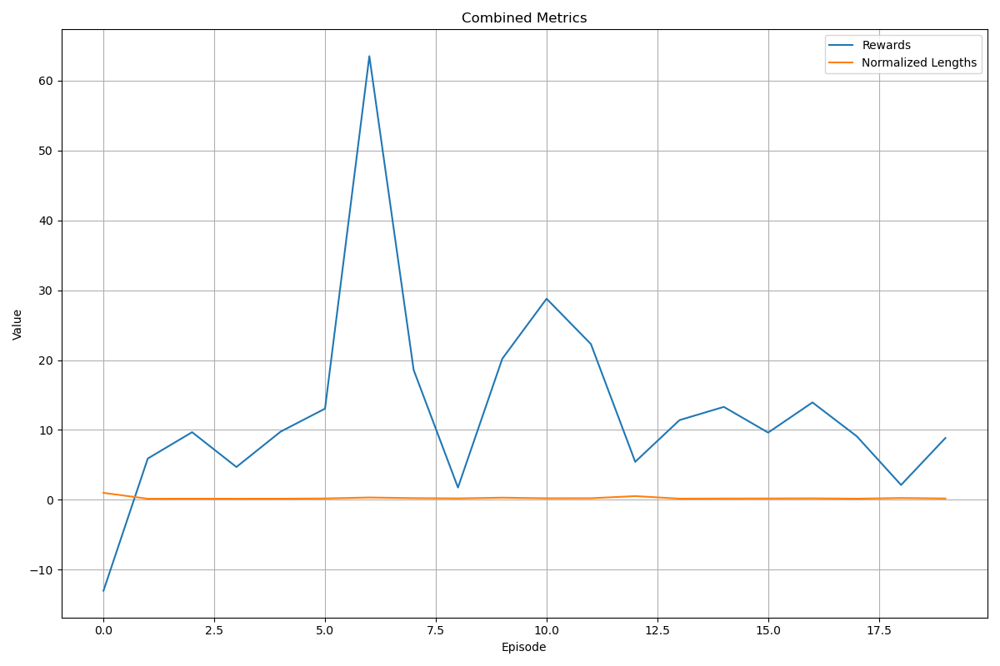
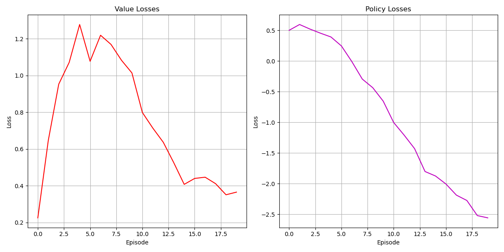
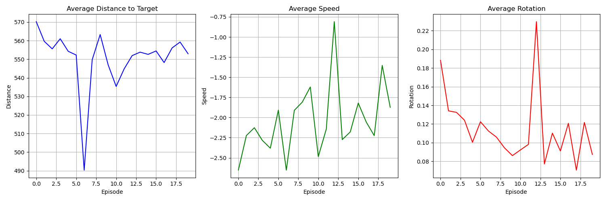
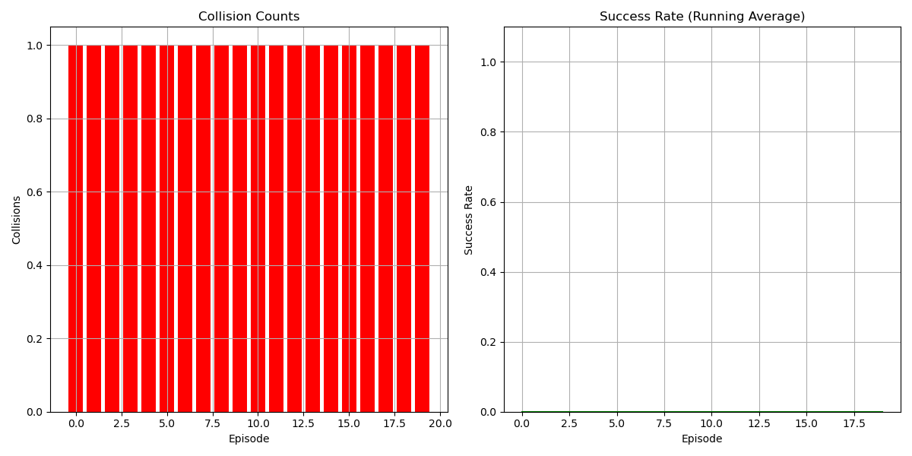
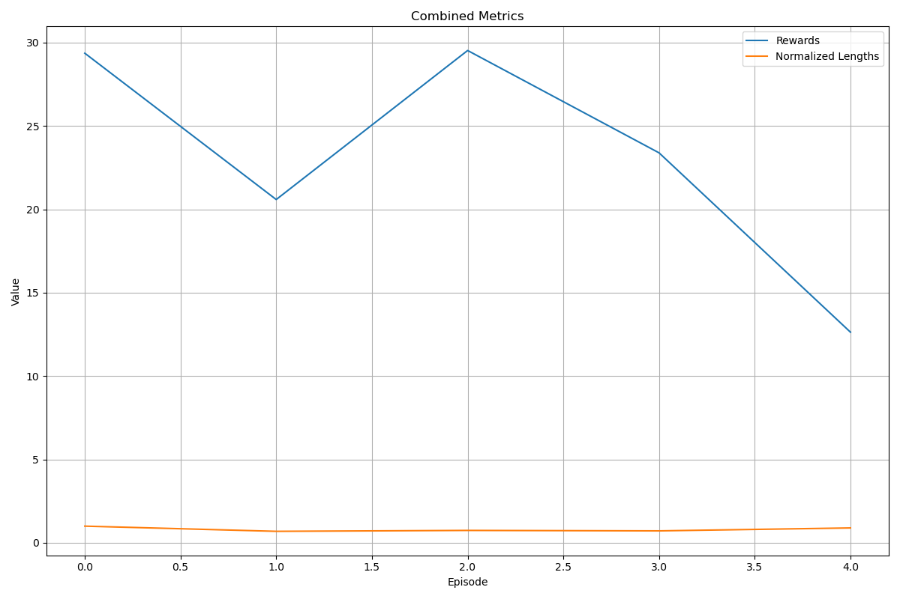
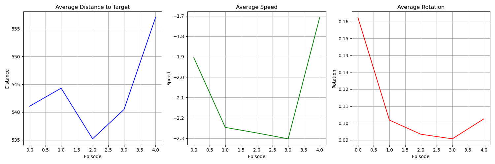
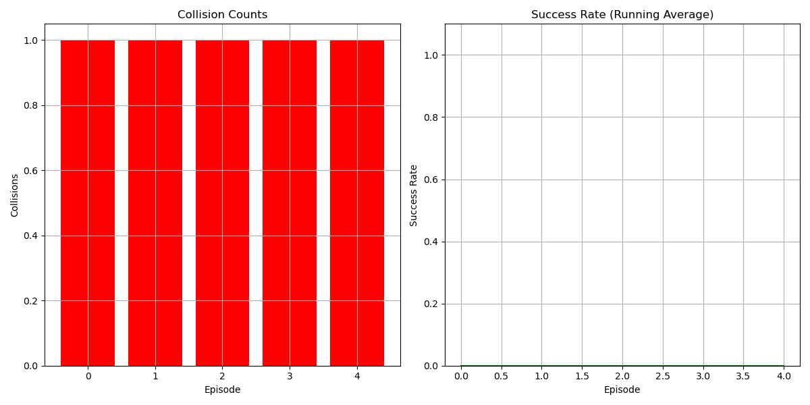
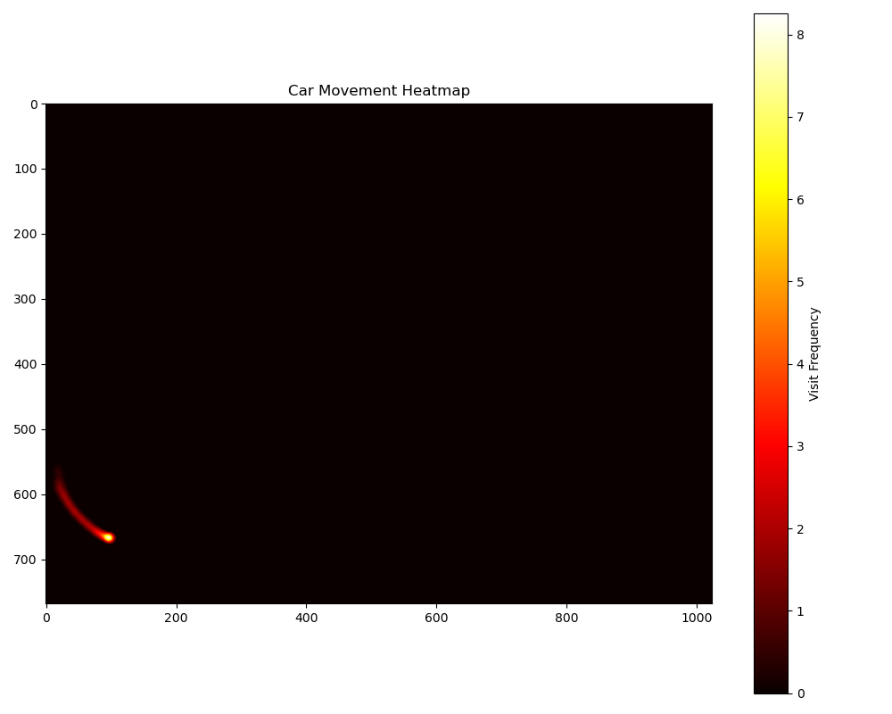
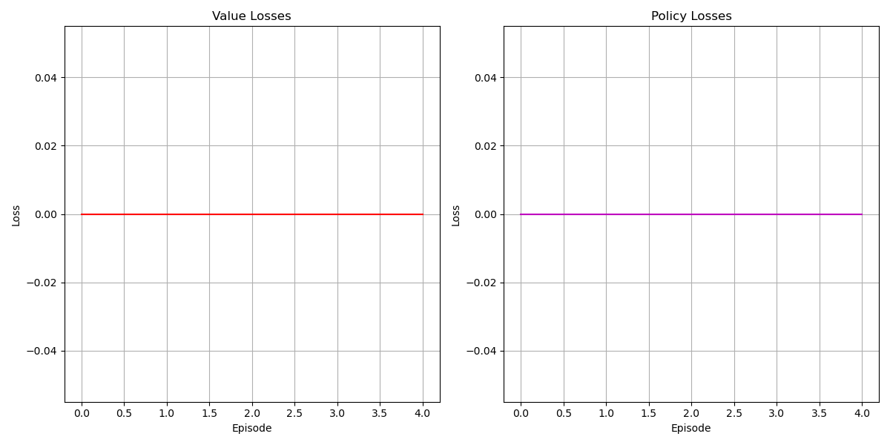

# 第三阶段-更加复杂的优化与改进

这是一个基于强化学习的2D自动驾驶项目，用于训练智能小车在复杂环境中寻找动态目标。项目实现了更真实的物理模型、动态目标移动和丰富的可视化功能。

## 项目特点

- 2D环境中的自动驾驶小车
- 真实物理模型（惯性、加速度、摩擦力、转向力学）
- 多模态感知系统（雷达和视觉）
- 动态和静态障碍物
- 平滑移动的动态目标（非瞬移）
- 高级强化学习算法
- 美观的可视化系统和详细数据记录
- 多种统计分析和热图生成
- 高质量视频录制功能

## 环境要求

- Python 3.8+
- PyTorch
- Gymnasium
- OpenCV
- Matplotlib
- 其他依赖见requirements.txt

## 安装

```bash
pip install -r requirements.txt
```

## 项目结构

```
.
├── src/                 # 源代码目录
│   ├── agent/           # 智能体模块
│   │   ├── __init__.py  # 初始化文件
│   │   └── agent.py     # 智能体实现，包含DDPG算法
│   ├── config/          # 配置文件
│   │   ├── __init__.py  # 初始化文件
│   │   └── environment_config.py  # 环境、障碍物、奖励等配置
│   ├── environment/     # 环境模块
│   │   ├── __init__.py  # 初始化文件
│   │   ├── environment.py  # 小车环境实现
│   │   └── geometry.py     # 几何计算工具
│   ├── models/          # 模型模块
│   │   ├── __init__.py  # 初始化文件
│   │   └── network.py   # 神经网络模型结构
│   ├── utils/           # 工具模块
│   │   ├── __init__.py  # 初始化文件
│   │   └── metrics.py   # 指标记录和分析
│   ├── visualization/   # 可视化模块
│   │   ├── __init__.py  # 初始化文件
│   │   └── visualizer.py  # 可视化工具
│   ├── train.py         # 训练主脚本
│   ├── test.py          # 测试与评估脚本
│   └── test_environment.py # 环境测试脚本
├── logs/                # 日志和结果保存目录
└── requirements.txt     # 项目依赖
```

## 核心文件功能

### 环境模块 (`src/environment/`)

- **environment.py**: 核心环境类，实现了:
  - 真实物理模型（速度、转向、惯性、摩擦力）
  - 雷达与视觉感知系统
  - 动态和静态障碍物管理
  - 动态目标管理
  - 碰撞检测
  - 奖励计算
  - 渲染功能

- **geometry.py**: 提供几何相关的计算工具:
  - 射线与圆相交计算
  - 碰撞检测算法
  - 获取车辆角点坐标

### 智能体模块 (`src/agent/`)

- **agent.py**: 实现强化学习智能体:
  - 基于DDPG (Deep Deterministic Policy Gradient)算法
  - 使用Actor-Critic网络结构
  - 经验回放缓冲区
  - 目标网络软更新
  - 探索噪声管理
  - 模型保存与加载

### 模型模块 (`src/models/`)

- **network.py**: 定义神经网络结构:
  - 多模态输入处理（雷达和视觉）
  - 卷积网络处理视觉输入
  - 全连接网络处理雷达输入
  - 融合网络整合多模态信息
  - Actor和Critic网络

### 配置模块 (`src/config/`)

- **environment_config.py**: 存储所有环境配置:
  - 环境基本参数（尺寸、小车参数、物理参数等）
  - 障碍物参数（数量、大小、速度等）
  - 目标参数（大小、移动特性等）
  - 奖励参数（各类奖励和惩罚权重）
  - 渲染参数（颜色、大小、可视化选项）

### 工具模块 (`src/utils/`)

- **metrics.py**: 提供指标记录和分析功能:
  - 训练过程指标记录
  - 性能评估
  - 数据可视化
  - 统计分析
  - 热图生成

### 可视化模块 (`src/visualization/`)

- **visualizer.py**: 负责环境可视化:
  - 渲染环境状态
  - 绘制车辆、障碍物和目标
  - 显示雷达、视觉和轨迹
  - 添加信息面板
  - 生成热图

## 测试训练实例说明

**重要说明**：以下展示的是20250519版本的测试训练结果，该版本仅作为系统功能验证，训练规模大幅缩减，因此性能表现有限。

### 1. 训练过程分析

#### 1.1 训练规模
- 总回合数：20回合
- 每回合平均步数：50-80步
- 训练目的：验证系统各模块功能完整性

#### 1.2 训练日志分析
从训练日志中可以看到以下关键数据：

初始回合（第1回合）：
```
奖励值：-13.02
回合长度：249步
价值损失：0.2249
策略损失：0.5015
碰撞次数：1次
目标未达成
```

最终回合（第20回合）：
```
评估奖励：9.86
碰撞次数：1次
目标未达成
```

#### 1.3 训练过程可视化

1. **训练过程指标图**：


2. **损失函数变化**：


3. **距离-速度-转向分析**：


4. **碰撞与成功率统计**：


5. **活动区域热图**：


### 2. 测试过程分析

#### 2.1 测试规模
- 测试回合数：5回合
- 每回合平均步数：59.8步（标准差：8.80步）
- 测试目的：验证模型在未见过的场景中的表现

#### 2.2 测试结果
从测试日志中可以看到以下关键数据：

```
平均奖励：23.10（标准差：6.27）
平均回合长度：59.8步（标准差：8.80步）
碰撞次数：每回合1次
目标达成率：0%
```

具体回合表现：
```
回合1：奖励29.36，长度74步，1次碰撞
回合2：奖励20.59，长度51步，1次碰撞
回合3：奖励29.52，长度55步，1次碰撞
回合4：奖励23.39，长度53步，1次碰撞
回合5：奖励12.63，长度66步，1次碰撞
```

#### 2.3 测试过程可视化

1. **测试性能指标图**：


2. **测试行为分析图**：


3. **测试碰撞与成功率统计**：


4. **测试活动区域热图**：


5. **测试损失函数变化**：


### 3. 综合评估

1. **性能表现**：
   - 训练过程：从随机行为逐渐学习到基本控制
   - 测试过程：表现出一定的稳定性，但性能有限
   - 主要问题：碰撞率高，目标达成率低

2. **系统功能验证**：
   - 环境交互：正常
   - 奖励计算：准确
   - 数据记录：完整
   - 可视化功能：正常

3. **改进方向**：
   - 增加训练回合数（建议至少1000回合）
   - 优化网络结构
   - 调整奖励函数
   - 增加环境复杂度
   - 改进碰撞避免策略
   - 优化目标追踪算法

## 使用说明

### 训练模型

默认参数训练:
```bash
python src/train.py
```

自定义参数训练:
```bash
python src/train.py --num_episodes 2000 --max_steps 1000 --learning_rate 1e-4 --save_dir logs/custom_training --visualize --video_interval 50
```

### 测试模型

基本测试:
```bash
python src/test.py --model_path logs/[训练日期]/model_best.pt
```

生成热图和完整分析:
```bash
python src/test.py --model_path logs/[训练日期]/model_best.pt --num_episodes 10 --heat_map --full_analysis
```

## 注意事项

1. 当前版本为测试版本，训练结果仅供参考
2. 建议在完整训练时调整以下参数：
   - 增加训练回合数（建议至少1000回合）
   - 调整学习率和网络结构
   - 优化奖励函数
   - 增加环境复杂度
3. 系统功能验证已完成，可以进行完整训练
4. 训练过程中可以通过查看实时日志和可视化输出来监控训练进展
5. 测试结果表明模型需要进一步优化才能达到实用水平 