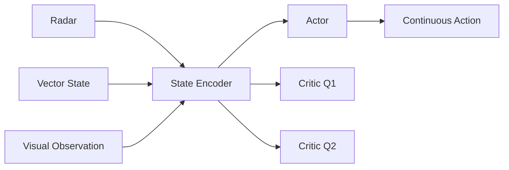
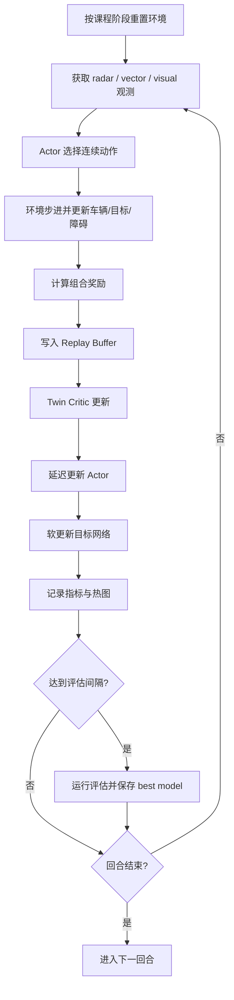

# 第三阶段：复杂场景实现与多模态集成

第三阶段是 RLDriverX 从“离散导航问题”走向“连续控制自动驾驶原型”的关键跃迁。它不再只是一个强化学习脚本，而是一个包含环境建模、连续控制、多模态观测、课程学习、日志与评估闭环的完整系统。

这部分代码已经完成了一次结构性重构。旧版第三阶段更偏功能验证，训练闭环并不正确；当前版本则围绕 TD3、干净观测与课程学习重新组织了系统。

## 目录

- [阶段目标](#阶段目标)
- [为什么第三阶段必须重构](#为什么第三阶段必须重构)
- [系统建模](#系统建模)
- [观测、动作与奖励](#观测动作与奖励)
- [TD3 与多模态结构](#td3-与多模态结构)
- [课程学习设计](#课程学习设计)
- [训练与评估流程](#训练与评估流程)
- [代码结构](#代码结构)
- [运行方式](#运行方式)
- [日志与输出](#日志与输出)
- [历史结果说明](#历史结果说明)
- [推荐使用策略](#推荐使用策略)

## 阶段目标

第三阶段想解决的不是“能不能避障”，而是更接近自动驾驶原型的问题：

1. 在连续动作空间中学习油门/制动与转向控制。
2. 在动态障碍与移动目标存在时保持可训练性。
3. 融合雷达、向量状态与视觉观测。
4. 通过课程学习降低复杂任务的训练难度。

用一句话概括，这一阶段试图把“导航智能体”推进成“复杂环境下的连续控制系统”。

## 为什么第三阶段必须重构

旧版第三阶段的问题不只是参数不理想，而是训练主干本身存在结构性错误：

- critic 没有真正接收 action，连续控制的值函数定义不成立。
- 奖励信号方向不够干净，容易鼓励无效移动。
- 训练输入直接使用演示渲染，混入了轨迹、信息面板等与策略学习无关的噪声。
- 一开始就把动态障碍、移动目标、多模态和连续控制全部叠加，难度过高。

因此，当前版本的目标不是“小修补”，而是重新建立一个正确、稳定、可扩展的训练闭环。

## 系统建模

第三阶段可以被建模为连续动作 MDP：

$$
\mathcal{M}=(\mathcal{S}, \mathcal{A}, \mathcal{P}, \mathcal{R}, \gamma)
$$

其中：

- 状态 $s_t$ 由雷达观测、向量状态和视觉图像组成；
- 动作 $a_t \in [-1,1]^2$，分别对应纵向控制与转向控制；
- 转移函数由车辆动力学、障碍物运动、目标运动共同决定；
- 奖励函数围绕“朝目标推进且避免危险行为”设计。

我们将观测定义为：

$$
s_t = \left(r_t,\; v_t,\; x_t\right)
$$

其中：

- $r_t$：雷达距离向量；
- $v_t$：向量状态，包含相对目标距离、方向误差、速度、转向和上一动作；
- $x_t$：干净的俯视图视觉观测。

## 观测、动作与奖励

### 观测

当前实现中，观测由三部分组成：

- `radar`：24 路归一化距离读数
- `vector`：8 维向量状态
- `visual`：`96 x 96` 的归一化图像

这种分解方式有一个重要工程意义：把“局部几何感知”“低维动态状态”“空间布局感知”分开编码，再进行融合。

### 动作

动作空间是二维连续向量：

$$
a_t = [u_t, \delta_t]
$$

其中：

- $u_t$ 表示纵向控制，兼顾加速、减速和倒车；
- $\delta_t$ 表示转向控制。

### 奖励

当前奖励函数不是单一奖励，而是一个组合式 shaping：

$$
r_t =
r_{\text{progress}}
r_{\text{distance}}
r_{\text{step}}
r_{\text{safety}}
r_{\text{smooth}}
r_{\text{reverse}}
r_{\text{stagnation}}
$$

其中：

- `progress`：鼓励朝目标净推进
- `distance`：鼓励整体接近目标
- `step penalty`：抑制无意义拖延
- `safety penalty`：惩罚靠近障碍与碰撞
- `smooth penalty`：抑制剧烈动作变化
- `reverse penalty`：降低无必要倒车
- `stagnation penalty`：惩罚长时间无进展

其设计原则很明确：奖励的主方向必须是“有效接近目标”，而不是“只要在动就给分”。

## TD3 与多模态结构

第三阶段当前使用 TD3，而不是 DDPG。目标值定义如下：

$$
y=r+\gamma (1-d)\min_{j=1,2}Q_{\phi_j^-}(s', \pi_{\theta^-}(s')+\epsilon)
$$

其中：

$$
\epsilon \sim \text{clip}(\mathcal{N}(0,\sigma),-c,c)
$$

Actor 的优化目标为：

$$
J(\theta)=\mathbb{E}_s[Q_{\phi_1}(s,\pi_\theta(s))]
$$

其梯度为：

$$
\nabla_\theta J(\theta)
=
\mathbb{E}_s\left[
\nabla_a Q_{\phi_1}(s,a)\vert_{a=\pi_\theta(s)}
\nabla_\theta \pi_\theta(s)
\right]
$$

### 网络结构思路

- `RadarVectorEncoder` 负责低维结构化信息。
- `VisualEncoder` 负责局部俯视图编码。
- `StateEncoder` 负责融合状态。
- `Actor` 输出连续动作。
- `TwinCritic` 估计两个 Q 值，降低过估计风险。


```mermaid
flowchart LR
    A[Radar] --> D[State Encoder]
    B[Vector State] --> D
    C[Visual Observation] --> D
    D --> E[Actor]
    D --> F[Critic Q1]
    D --> G[Critic Q2]
    E --> H[Continuous Action]
```

## 课程学习设计

第三阶段不是从最难环境直接开始，而是按阶段逐步提升任务复杂度。

| 课程阶段 | 静态障碍 | 动态障碍 | 移动目标 | 任务特点 |
| --- | --- | --- | --- | --- |
| `stage_0_basic` | 4 | 0 | 否 | 固定目标，建立最基础控制能力 |
| `stage_1_random_goal` | 8 | 0 | 否 | 随机目标，提高泛化压力 |
| `stage_2_dynamic_obstacles` | 10 | 4 | 否 | 加入动态风险源 |
| `stage_3_multimodal_full` | 12 | 6 | 是 | 完整复杂场景 |

课程切换计划在配置中写作：

```text
episode 0   -> stage 0
episode 180 -> stage 1
episode 420 -> stage 2
episode 680 -> stage 3
```

这背后的思想是：先学会“往目标走”，再学会“在复杂环境中稳健地往目标走”。

## 训练与评估流程


```mermaid
flowchart TD
    A[按课程阶段重置环境] --> B[获取 radar / vector / visual 观测]
    B --> C[Actor 选择连续动作]
    C --> D[环境步进并更新车辆/目标/障碍]
    D --> E[计算组合奖励]
    E --> F[写入 Replay Buffer]
    F --> G[Twin Critic 更新]
    G --> H[延迟更新 Actor]
    H --> I[软更新目标网络]
    I --> J[记录指标与热图]
    J --> K{达到评估间隔?}
    K -- 是 --> L[运行评估并保存 best model]
    K -- 否 --> M{回合结束?}
    L --> M
    M -- 否 --> B
    M -- 是 --> N[进入下一回合]
```

## 代码结构

```text
Third Try-复杂场景实现与多模态集成/
├── requirements.txt
├── README.md
├── logs/                   # 历史实验记录（旧版实现）
└── src/
    ├── agent/
    │   └── agent.py
    ├── config/
    │   └── environment_config.py
    ├── environment/
    │   ├── environment.py
    │   └── geometry.py
    ├── models/
    │   └── network.py
    ├── utils/
    │   └── metrics.py
    ├── visualization/
    │   └── visualizer.py
    ├── train.py
    ├── test.py
    └── test_environment.py
```

## 运行方式

### 安装依赖

```bash
pip install -r requirements.txt
```

### 训练

```bash
python src/train.py
```

示例：

```bash
python src/train.py \
  --num_episodes 1200 \
  --max_steps 320 \
  --eval_interval 25 \
  --eval_episodes 8 \
  --render
```

如果你想优先跑一个更稳定的基线：

```bash
python src/train.py --disable_visual
```

### 测试

```bash
python src/test.py --model_path logs/<run_name>/best_model.pt
```

指定课程阶段测试：

```bash
python src/test.py --model_path logs/<run_name>/best_model.pt --curriculum_stage 3
```

### 环境冒烟测试

```bash
python src/test_environment.py --num_steps 100 --curriculum_stage 0
```

## 日志与输出

每次训练会在 `logs/<timestamp>/` 下生成：

- `config.json`
- `train_log.csv`
- `best_model.pt`
- `final_model.pt`
- `final_metrics/`
- `final_plots/`
- `final_heatmap.png`
- `episode_summary.png`
- `summary.txt`

评估会在 `logs/test_<timestamp>/` 下生成：

- `results.json`
- `metrics.json`
- `heatmap.png`
- `episode_summary.png`
- 每回合视频

## 历史结果说明

仓库中当前保留的 `logs/20250519_*` 与 `logs/test_20250519_*` 是旧版第三阶段留下的历史结果。它们可以说明：

- 旧版系统完成了功能验证；
- 但旧版训练闭环无法支撑稳定有效的连续控制学习。

例如旧版测试结果中：

- `mean_reward ≈ 23.10`
- `mean_length ≈ 59.8`
- `success_rate = 0`
- `mean_collisions = 1.0`

这正是第三阶段必须重构的现实证据之一。

## 推荐使用策略

第三阶段更适合按两步来使用：

1. 先关闭视觉分支，跑 `--disable_visual` 基线，验证环境与连续控制训练是否稳定。
2. 基线稳定后，再打开视觉分支进行完整多模态训练。

这样做的原因很简单：如果一开始就把所有复杂度同时打开，问题将很难定位，也很难判断“视觉到底是在帮忙，还是在引入噪声”。

因此，第三阶段当前最重要的价值，不只是“做复杂”，而是“把复杂系统做对”。
