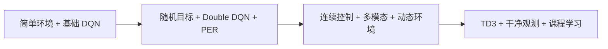
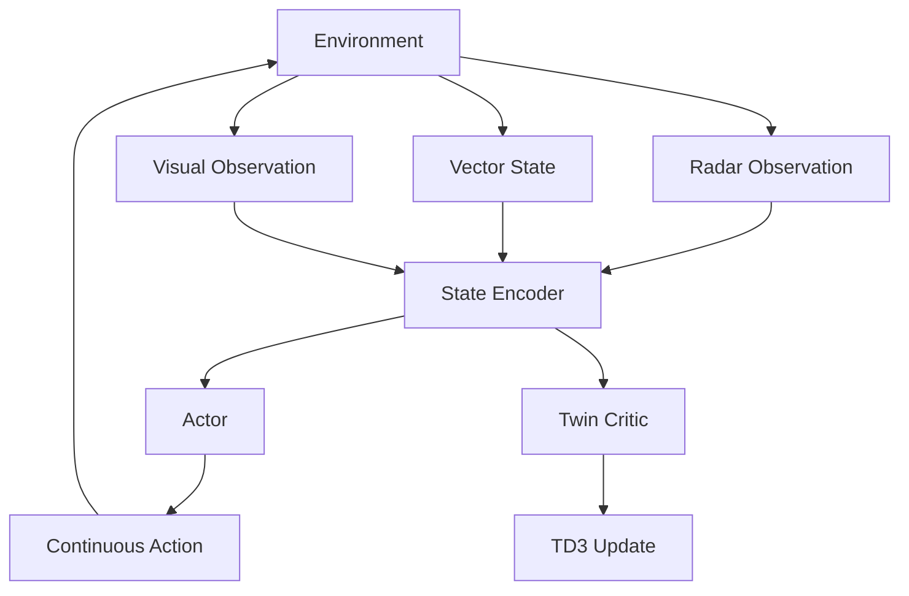

# RLDriverX 技术路线与方法论

这份文档是 RLDriverX 的方法论说明，用来回答三个问题：

1. 为什么项目要按三个阶段推进。
2. 每个阶段的方法选择背后是什么逻辑。
3. 第三阶段为什么必须重构，以及当前重构方案为什么更合理。

## 1. 从工程原型到系统设计

RLDriverX 的发展路径可以理解为一个“先建立最小可行系统，再逐步提升复杂度”的过程。

这条路径遵循的是一种常见的工程原则：

- 先用低复杂度环境验证问题可学。
- 再通过算法增强提升性能和稳定性。
- 最后才进入高自由度、高复杂度、多模块耦合的系统设计。

如果一开始就直接做第三阶段，问题通常不在于“能不能写出来”，而在于“出了问题无法定位到底是环境、奖励、观测还是算法本身”。

## 2. 三个阶段的强化学习形式差异

### 第一阶段：离散值函数学习

第一阶段使用 DQN，核心思想是学习：

$$
Q(s,a)
$$

并通过 Bellman 最优方程迭代逼近最优值函数：

$$
Q^\*(s,a)=\mathbb{E}\left[r+\gamma \max_{a'}Q^\*(s',a') \mid s,a\right]
$$

这个阶段最重要的不是性能，而是把值函数学习、经验回放和目标网络三件事跑通。

### 第二阶段：减偏差与提效率

第二阶段解决的是两个 DQN 常见问题：

- Q 值过估计
- 难样本学习效率不高

于是引入：

- Double DQN
- Prioritized Experience Replay

Double DQN 的核心目标值是：

$$
y=r+\gamma Q_{\theta^-}(s', \arg\max_{a'}Q_\theta(s',a'))
$$

PER 则通过 TD 误差控制采样概率：

$$
P(i)=\frac{p_i^\alpha}{\sum_k p_k^\alpha}
$$

### 第三阶段：连续控制与策略梯度

当动作从离散切换到连续后，不能再简单枚举：

$$
\arg\max_a Q(s,a)
$$

因为 $a$ 已经是连续空间中的向量。此时更合适的方法是 Actor-Critic：

- Actor 输出连续动作
- Critic 评估动作价值

当前第三阶段采用 TD3，其关键目标值为：

$$
y=r+\gamma (1-d)\min_{j=1,2}Q_{\phi_j^-}(s', \pi_{\theta^-}(s')+\epsilon)
$$

## 3. 第三阶段为什么旧版不够对

旧版第三阶段有几个典型问题：

### 3.1 Critic 没有正确建模 $Q(s,a)$

连续控制里的 critic 必须显式接收动作输入，否则它学到的更像状态值而非动作值。这会直接破坏策略梯度更新的前提。

### 3.2 训练输入与展示输入混杂

旧版直接使用带轨迹、信息面板、演示元素的渲染图作为训练输入，这会引入策略无关噪声，降低学习效率。

### 3.3 奖励目标不够聚焦

如果奖励过度鼓励“移动本身”，而不是“朝目标有效移动”，智能体就可能学到看似积极、实则低效的行为。

### 3.4 任务复杂度引入过快

动态障碍、移动目标、多模态输入和连续控制同时上线，会让训练难度骤增。此时即使结果不好，也很难知道是哪一层出了问题。

## 4. 为什么当前重构方案更合理

### 4.1 干净观测

当前观测拆分为：

$$
s_t = (r_t, v_t, x_t)
$$

其中：

- $r_t$：雷达距离向量
- $v_t$：向量状态
- $x_t$：干净视觉观测

这意味着不同模态的信息职责清晰，网络可以分别编码再融合。

### 4.2 Twin Critic

TD3 使用两个 critic：

$$
Q_{\phi_1}(s,a),\quad Q_{\phi_2}(s,a)
$$

训练时用二者最小值作为目标，减小过估计：

$$
\min(Q_{\phi_1^-}, Q_{\phi_2^-})
$$

### 4.3 延迟更新策略

Actor 并不是每一步都更新，而是延迟更新。这样可以让 critic 先更稳定地逼近目标，再反向指导策略。

### 4.4 课程学习

课程学习本质上是在控制任务分布：

$$
\mathcal{T}_0 \rightarrow \mathcal{T}_1 \rightarrow \mathcal{T}_2 \rightarrow \mathcal{T}_3
$$

每一步只增加部分复杂度，使策略始终建立在已有能力上。

## 5. 当前第三阶段的系统组成

## 6. 如何阅读和使用这个仓库

### 如果你的目标是理解原理

建议顺序：

1. 第一阶段
2. 第二阶段
3. 第三阶段

这样最容易理解问题是如何逐步升级的。

### 如果你的目标是展示效果

建议优先展示第二阶段，因为它在当前仓库里效果最成熟。

### 如果你的目标是继续开发

建议从第三阶段开始，但训练顺序推荐：

1. 先跑 `--disable_visual`
2. 再打开视觉分支
3. 最后延长训练回合并正式评估

## 7. 一句话总结

RLDriverX 最值得看的地方，不只是“做了三个阶段”，而是它清楚地展示了一件事：

一个复杂强化学习系统要想真正成立，必须同时把环境、观测、奖励、算法和训练流程都设计对。单独把某一个模块做复杂，并不会自动带来更好的结果。
